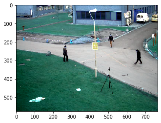
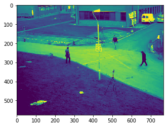

# OpenCV Tutorial-1

Görüntü işleme işlemlerinde kullnaılan en temel kütüphanelerdendir. Intel ve NVIDIA gibi şeiketler tarafından üretilmiştir.
Günümüzde yüz tanıma, araç plaka okuma sistemi vb. durumlarda çok fazla kullanımaktadır.
Google, Yahoo, Microsoft, Intel vb. firmalar tarafından oldukça sık kullanımlamtadır.
OpenCv kütüphanelsini python, matlab, java vb. programlama dilleri ile kullanılabilir.
Camputer Vision, Machine Learning vb. bileşenlerle birlikte kullanılabilir.

Bu eğitim bölümünde temel seviyede opencv kütüphanesi kullanarak görüntü işleme üzerinde çalışılacaktır.

Öncelikli olarak OpenCV kütüphanesi eklenir.
Daha sonra numpy kütüphanesi eklenir. Numpy kütüphanesi resimlerin dizi şekilde sayısal olarak gösterilmesine yarar.
Diğer eklenen kütüphane ise matplotlib kütüphanesidir ki bu kütüphanel ile birlikte resimleri gösteriminde kullanabiliriz.


```python
import cv2
import numpy as np
import matplotlib.pyplot as plt
```

# OpenCv kütüphanesi kullanarak resim eklemek

Adım adım ilerlendiğinde gerekli kütüphaneleri yükledikten sonra eklenmek istenen resim yüklenir.
"img" yüklenecek olan resim bilgisine verilen değişken tanımlamasıdır.
Yüklenmiş olan OpenCV kütüphanesi cv2 temsil ismi ile nitelendirilir.

   * "imread" fonksiyonu eklenen resmi array olarak  okur.


```python
img=cv2.imread("Background_Subtraction_Tutorial_frame.png")
img
```


    array([[[104, 142, 177],
            [105, 143, 178],
            [105, 143, 178],
            ...,
            [ 57,  83, 107],
            [ 70,  80, 106],
            [ 41,  51,  77]],
    
           [[105, 143, 178],
            [105, 143, 178],
            [105, 143, 178],
            ...,
            [ 55,  81, 105],
            [ 71,  81, 107],
            [ 44,  54,  80]],
    
           [[105, 143, 178],
            [105, 143, 178],
            [105, 143, 178],
            ...,
            [ 51,  76, 102],
            [ 73,  84, 107],
            [ 49,  60,  83]],
    
           ...,
    
           [[  0,  35,  20],
            [  0,  35,  20],
            [  0,  36,  21],
            ...,
            [  9,  72,  60],
            [ 11,  74,  62],
            [ 11,  74,  62]],
    
           [[  0,  35,  20],
            [  0,  35,  20],
            [  0,  36,  21],
            ...,
            [  8,  71,  59],
            [  9,  72,  60],
            [ 11,  74,  62]],
    
           [[  0,  35,  20],
            [  0,  35,  20],
            [  0,  36,  21],
            ...,
            [  9,  72,  60],
            [ 11,  74,  62],
            [ 13,  76,  64]]], dtype=uint8)


Eklenmiş olan resimi görüntü olarak eklenmek istenirse aşağıdaki kod blogu kullanılır. 
Yazılan bu kod blogu ekranda yeni bir sayfa açarak gösterimde bulunur.

   * "namedWindow" fonksiyonu ile eklenen resim ekranı istenildiği gibi kenarından tutularak büyür ve küçültülür.
   * "imshow" fonsiyonu resim göstermek için kullanılan fonksiyondur.
   * "waitKey" fonksiyonu ise gösterilecek resmin kaç milisaniye olarak gösterimini yapar. "0" değeri biz kapatana kadardır.
   * "destroyAllWindows" fonksiyonu açılan pencereyi istenilen harf yazılarak kapatılabilir.


```python
cv2.namedWindow("Resim",cv2.WINDOW_NORMAL)
cv2.imshow("Resim",img)
cv2.waitKey(0)
cv2.destroyAllWindows()
```

Matplotlib kütüphanesini kullanarak eklenmiş olan resmi göstermek

   * "plt" matplotlib kütüphanesinin kısa adıdır.


```python
plt.imshow(img)
plt.show()
```





Eklenen resmin "shape" ile kaç farklı renk ile gösterilebileceği ögrenilir. 
Bunun için array de son sütün renk bölümünü temsil eder. 


```python
img.shape
```


    (576, 768, 3)


```python
plt.imshow(img[:,:,0])
plt.show()
```





Eklenen resmi farklı renklerde göstermek için "cmap" fonksiyonu kullanılabilir.


```python
plt.imshow(img,cmap="gray")
plt.show()
```


Sisteme yüklenmiş olan bir resmi istenilen bir yere kopyalanabilir.

  * "imwrite" fonksiyonu kullanrak resim istenilen path eklenir.


```python
cv2.imwrite("path",img)
```

# Webcam üzerinden video görüntüsü almak

Bu bölümde ise bir webcam üzerinden nasıl görüntü alınabilir ve örnek kod blogu üzerinden ilerleyelim.

  * "cap" görüntü capture edilirken kullanılan değişken adıdır.
  * "VideoCapture" fonksiyonu görüntü almaya yarar. "0" ile webcam üzerinden görüntü alınır.
  * "frame" framler yakalanarak sonsuz kez okuma yapılır.
  * "flip" fonksiyonu alınan görüntüyü ters çevirir ve kendimizi aynada gibi görmemize yarar.
  * "0xFF ve ord" fonksiyonu alınan görüntü klavye den "q" harfine basılarak çıkması sağlanır.
  * "release" ise görüntü işleminin kapatılmasına yarar.


```python
cap=cv2.VideoCapture(0)  
while True:
    
    ret,frame=cap.read()   
    
    frame=cv2.flip(frame,1)  
    
    cv2.imshow("WebCam",frame)
    
    if cv2.waitKey(1) & 0xFF==ord("q"):    
        break
    
cap.release()  
cv2.destroyAllWindows()
```

# Webcam üzerinden alınan görüntüyü dosya sistemine eklemek

Alınan görüntü "VideoWriter_fourcc" fonksiyonu kullanarak gerekli parametreler girilir.
"resolution" ile piksel özelliği set edilir.
"video.writer" fonksiyonu ile de frame'leri çıktı olarak eklenir.


```python
cap=cv2.VideoCapture(0)  

fileName="D:\\Desktop\\ensar.avi"
codec=cv2.VideoWriter_fourcc('W','M','V','2')
frameRate=30
resolution=(640,480)

video=cv2.VideoWriter(fileName,codec,frameRate,resolution)

while True:
    
    ret,frame=cap.read()   
    
    
    frame=cv2.flip(frame,1)
    
    video.write(frame)    #frame leri video_output eklemek için kullanılır.
    
    cv2.imshow("Webcam",frame)
    
    if cv2.waitKey(1) & 0xFF==ord("q"):   
        break

video.release()
cap.release() 
cv2.destroyAllWindows()
```

# OpenCv kütüphanesi ile var olan video'yu eklemek


```python
cap=cv2.VideoCapture("Background-Subtraction-Tutorial_merged.mp4")

while True:
    ret,frame=cap.read()
    
    if ret==0:
        break
        
    frame=cv2.flip(frame,1)
    
    cv2.imshow("Background-Subtraction-Tutorial_merged",frame)
    
    if cv2.waitKey(10) & 0xFF==('q'):
        break
cap.release()
cv2.destroyAllWindows()
```


```python

```
